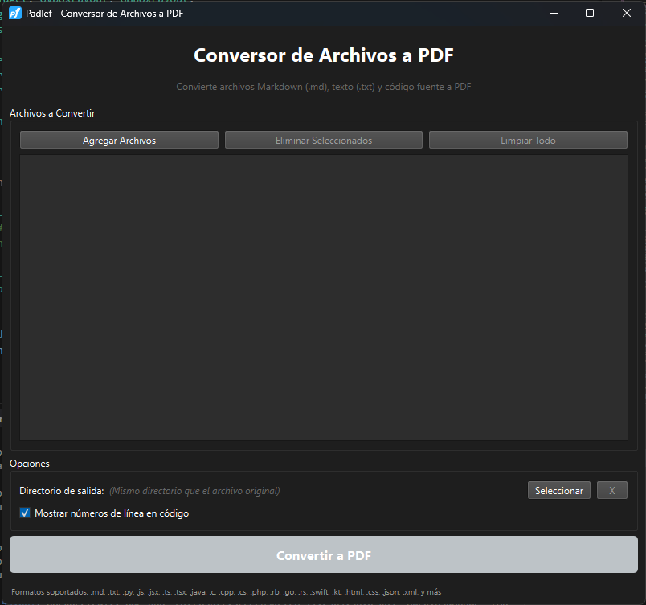

# Padlef - Conversor de Archivos a PDF

Aplicación de escritorio para convertir archivos Markdown, texto plano y código fuente a PDF con resaltado de sintaxis.

## Características

- Conversión de archivos Markdown (.md)
- Conversión de archivos de texto (.txt)
- Conversión de código fuente con resaltado de sintaxis (.js, .jsx, .py, .java, etc.)
- Interfaz gráfica moderna y fácil de usar
- Soporte para múltiples archivos simultáneamente
- Números de línea opcionales en código
- Aplicación de escritorio independiente

## Requisitos

- Windows 10 o superior (64-bit)
- No requiere Python instalado
- No requiere dependencias externas

## Instalación

### Opción 1: Instalador (Recomendado)

1. Descarga `Padlef-Setup.exe` desde la carpeta `installer/`
2. Ejecuta el instalador
3. Sigue las instrucciones del asistente
4. ¡Listo! La aplicación estará instalada

### Opción 2: Ejecutable Portable

1. Descarga el ejecutable `mdPdf.exe` desde la carpeta `dist/`
2. Ejecuta directamente (no requiere instalación)
